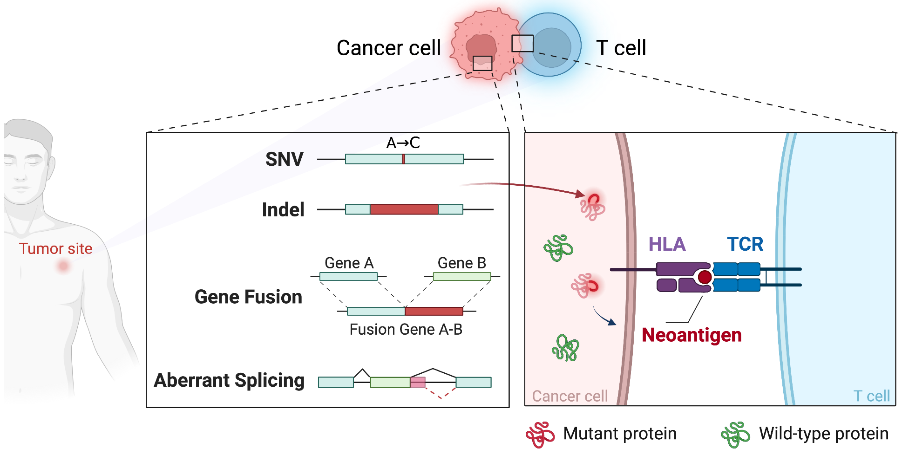

# NeoHunter:  flexible software for systematically detecting neoantigens from sequencing data

NeoHunter is a flexible software to systematically detect and prioritize neoantigens from sequencing data in different formats. Importantly, NeoHunter can detect not only SNV- and indel-derived neoantigens but also gene fusion- and splicing variant-derived neoantigens. NeoHunter supports both direct and indirect immunogenicity evaluation strategies to prioritize candidate neoantigens. These strategies utilize binding characteristics, existing biological big data, and T-cell receptor specificity to ensure accurate detection and prioritization.

## Dependencies
#### Download package
* [GATK 4.2.6.1](https://github.com/broadinstitute/gatk/releases/download/4.2.6.1/gatk-4.2.6.1.zip)
* [MiXCR](https://github.com/milaboratory/mixcr/releases/download/v4.0.0/mixcr-4.0.0.zip)
* [NetMHCpan4.1](https://services.healthtech.dtu.dk/services/NetMHCpan-4.1/9-Downloads.php#)
* [NetMHCstabpan1.0](https://services.healthtech.dtu.dk/services/NetMHCstabpan-1.0/9-Downloads.php#)
* [SnpEff](https://snpeff.blob.core.windows.net/versions/snpEff_latest_core.zip)
* [STAR-Fusion 1.11.0](https://github.com/STAR-Fusion/STAR-Fusion/releases/download/STAR-Fusion-v1.11.0/STAR-Fusion-v1.11.0.FULL.tar.gz)
* [STAR 2.7.8](https://github.com/alexdobin/STAR/archive/2.7.8a.tar.gz)
#### conda install package
* [Optitype](https://github.com/FRED-2/OptiType)

        conda install -c bioconda optitype
* [VEP (release-105)](https://uswest.ensembl.org/info/docs/tools/vep/index.html)

        conda install -c bioconda ensembl-vep

## Installation
1. Install all software listed above.
2. Download or clone the NeoHunter repository to your local system:

        git clone https://github.com/XuegongLab/NeoHunter.git

3. Download database:

        bash data_download.sh

|Database|Description|
| ------ | --------|
|reference gene fasta file||
|1000 human genome dataset|a catalogue of common human genetic variation from The 1000 Genomes Project|
|dbSNP database|a variation database at the National Center for Biotechnology Information (NCBI)|
|Mills database|a database of mutations in cancer-related genes that have been identified in various types of cancer|
|VEP annotations|an archive file that contains the Variant Effect Predictor (VEP) annotation data for the human genome assembly GRCh37|
|GRCh37_gencode_v19|a reference genome assembly and gene annotation for the human genome. It is used in gene fusion detection|
|Funcotator annotation|functional annotations for the variants from multiple annotation sources, including gene annotations, sequence annotations, and functional annotations|
|GRCh37 cdna reference fasta file| a dataset that contains the cDNA sequences for the human genome assembly GRCh37|
|GRCh37 peptide reference fasta file|a dataset that contains the protein sequences for the human genome assembly GRCh37|

## Usage
The software will take RNA-seq or/and WES/WGS file as input files, or take VCF file as single input file. It will output a ranking of candidate neoantigens according to the input parameters.

        python NeoHunter.py -p patient# -o ./output_path \
	        -dn1 /path/to/DNANormal_1 -dn2 /path/to/DNANormal_2 \
	        -dt1 /path/to/DNATumor_1 -dt2 /path/to/DNATumor_2 \
	        -rt1 /path/to/RNASeqTumor_1 -rt2 /path/to/RNASeqTumor_2 \
	        -vcf None -hla None -ps both -t 64

### Options of NeoHunter
|Argument|Description|
| ------ | --------|
|-p,--Prefix|Output files prefix|
|-o, --OutputFolder|Path to the output directory|
|-dn1, --DNANormal1|Path to normal WES/WGS read1 file|
|-dn2, --DNANormal2|Optional: Path to normal WES/WGS read2 file, only for paired-end sequencing data|
|-dt1, --DNATumor1|Path to tumor WES/WGS read1 file|
|-dt2, --DNATumor2|Optional: Path to tumor WES/WGS read2 file, only for paired-end sequencing data|
|-rt1, --RNATumor1|Path to tumor RNA-seq read1 file|
|-rt2, --RNATumor2|Optional: Path to tumor RNA-seq read2 file, only for paired-end sequencing data|
|-ps, --PrioritizationStrategy|Type of prioritization strategy (one of `direct`, `indirect`, `both`)|
|-at, --AlterationType|Optional: Target types of variations to detect neoantigens. Default value is snv,indel,fusion,splicing. Users can use comma to combine target types together. For example, for detecting fusion- and splicing-derived neoantigens, users should set this argument as fusion,splicing|
|-l, --IntervalList|Optional: Path to the bed file defined subsets of genomics regions. This argument works only when SNVs or indels are set as target types of variations that derive neoantigens, i.e., snv or indel is included in `-at, --AlterationType`. If this argument is provided, the software will detect potential SNVs or indels on the given regions. If this argument is not provided, the software will detect SNVs or indels along the whole genome|
|-vcf, --MutationVCF|Optional: Path to the VCF file of SNVs/indels. If there is no argument input, program will search for sequencing file as input|
|-hla, --HLAString|Optional: Four-digit HLA string input, e.g., `HLA-A01:01`. If this argument is provided, the software will consider the HLA as the given type rather than typing HLA allels from the sequencing data|
|-t, --Thread|Optional: Number of threads running in parallel, default is `8`|
|-ba, --BindingAffinity|Optional: binding affinity threshold, default value is `500`|
|-bs, --BindingStability|Optional: binding stability threshold, default value is `1`|
|-ta, --TumorAbundance|Optional: tumor abundance threshold, default value is `1`|
|-ag, --Agretopicity|Optional: agretopicity threshold, default value is `0.1`|
|-fo, --Foreignness|Optional: foreignness threshold, default value is `1e-12` (which represents that the threshold is 10−12)|
|-td, --TumorDepth|Optional: tumor allele depth threshold, default is `5`|
|-tv, --TumorVAF|Optional: tumor variant allele frequency threshold, default value is `0.1`|
|-nv, --NormalVAF|Optional: normal variant allele frequency threshold, default value is `0.05`|

## Descriptions of main NeoHunter outputs
|Folder|File/Subfolder|Description|
| ---- | ---- | ---- |
|genome_alignment|prefix_[normal/tumor].bam|alignment files of genome sequencing data|
||prefix_[normal/tumor].bam.bai|index files|
||prefix_[normal/tumor]_stat.tsv|alignment metrics|
|alteration_detection|prefix_alteration_derived_pep.fasta|alteration-derived peptides, including all target alteration types|
||prefix_splicing.fasta|splicing variant-derived peptides|
||prefix_snv_indel.fasta|SNV/indel-derived peptides|
||prefix_fusion.fasta|fusion-derived peptides|
||prefix_snv_indel_output (folder)|intermediate files of SNV and indel calling|
||prefix_fusion_output (folder)|intermediate files of fusion calling|
||prefix_splicing_output (folder)|intermediate files of splicing variant calling|
||prefix_transcript_quantification (folder)|intermediate files of transcript quantification|
||tmp (folder)|intermediate files|
|info|prefix_snv_indel.vcf|annotation info of snv/indel|
||prefix_fusion.tsv|annotation info of fusion|
||prefix_splicing.csv|annotation info of splicing|
|hla_typing|prefix_hla_coverage_plot.pdf|read coverage plot of HLA alleles|
||prefix_hla.tsv|four-digit HLA alleles|
|pMHC_binding_prediction|prefix_bindaff_raw.tsv|peptide-MHC pairs and corresponding predicted binding affinity|
||prefix_bindaff_filtered.tsv|dicted binding affinity; filtering criteria: (1) binding level is considered weak or strong; (2) binding affinity is not larger than 500. The threshold is controlled by the argument -ba, --BindingAffinity|
||prefix_bindstab_raw.csv|peptide-MHC pairs and corresponding binding stability; pMHCs are from prefix_bindaff_filtered.tsv|
||prefix_candidate_pmhc.csv|candidate neoantigens and matched MHCs; pMHCs from prefix_bindstab_raw.csv are retained if corresponding binding stability is not|
||tmp (folder)|intermediate files|
|prioritization|prefix_cdr_ergo.csv|cdr3 sequence as ranking software input|
||prefix_neoantigen_rank_tcr_specificity.tsv|direct method ranks of peptide-MHC pairs|
||prefix_neoantigen_rank_recognition_associated.tsv|indirect method ranks of peptide-MHC pairs|
||prefix_rank_output.csv|direct tcr specificity prediction input for ranking software|
||prefix_tcr_specificity_score.csv|tcr specificity prediction from ranking software|
|log|prefix_*.log|logs of sub-programs|less than 1. The threshold is controlled by the argument -bs, --BindingStability|
## Descriptions of ranked candidate neoantigens
|Term|Description|
|----|----|
|HLA-type|HLA allele|
|MT_pep|mutant peptide sequence|
|WT_pep|wild-type peptide sequence|
|BindAff|binding affinity between the peptide and HLA allele|
|AlterationType|type of alteration generating the mutant peptide|
|Quantification|expression level of the peptide|
|BindStab|binding stability between the peptide and HLA allele|
|Foreignness|foreignness|
|Agretopicity|agretopicity|
|SourceAlterationDetail|details of the alteration|
|Rank|rank of the neoantigen|
## Descriptions of peptide data (fasta)
|Example data|Term|Description|
|----|----|----|
|>SNV_12_34_TAASIEGSNS|>|inducing header that describe the following peptide|
||SNV|type of the alteration|
||_12|number of line in the corresponding alteration type info file|
||_34|expression level of the peptide round to 0.1, and x10|
||TAASIEGSNS|peptide sequence|
## Descriptions of HLA typing data
Example data
|A1|A2|B1|B2|C1|C2|Reads|Objective|
|---|---|---|---|---|---|---|---|
|A*02:01|A*68:01|B*44:02|B*15:07|C*03:03|C*07:04|46279.0|45029.467|

Explanation
|Term|Description|
|----|----|
|A1,A2,B1,B2,C1,C2|type of HLA alleles|
|Reads|number of reads covering HLA allele regions|
|Objective|value of objective function|
## Descriptions of SNV/indel data
Example data
||
|----------------------|
|## ENSEMBL VARIANT EFFECT PREDICTOR v105.0|
|## Output produced at 2022-05-07 09:44:38|
|## ...Header...|
|#Uploaded_variation Location Allele Gene Feature Feature_type Consequence cDNA_position CDS_position Protein_position Amino_acids Codons Existing_variation Extra|
|...Data...|

Explanation
|Term|Description|
|----|----|
|##|guiding header|
|#|guiding column name|
|Uploaded_variation|chromosome_start_alleles|
|Location|chromosome:position|
|Allele|variant allele|
|Gene|ensembl gene ID|
|Feature|ensembl feature ID|
|Feature_type|feature type, e.g., Transcript|
|Consequence|consequence type of the variant, e.g., synonymous_variant, missense_variant, inframe_insertion, inframe_deletion, frameshift_variant|
|cDNA_position|position of the base pair in cDNA sequence|
|CDS_position|position of the base pair in coding sequence|
|Protein_position|position of the amino acid in protein|
|Amino_acids|alternative amino acid affected by the variation|
|Codons|alternative codons with the variant base in upper case|
|Existing_variation|variation ID if the variation is known in related databases like dbSNP|
|Extra|extra information|

## Descriptions of fusion data
|Term|Description|
|----|----|
|#|guiding column name|
|FusionName|left partner gene -- right partner gene|
|JunctionReadCount|the number of fragments containing a read which covers the putative breakpoint|
|SpanningFragCount|the number of fragments that the two reads align to different partner genes|
|est_J|estimated junction read count, considering considering factors such as multiple-mappings and read-to-fusion-isoform mapping uncertainty|
|est_S|estimated spanning read count, considering considering factors such as multiple-mappings and read-to-fusion-isoform mapping uncertainty|
|SpliceType|indicating weather the breakpoint occurs at known reference annotation splice junctions|
|LeftGene|gene name and gene ID of the left partner gene|
|LeftBreakpoint|coordinate of the breakpoint in the left gene|
|RightGene|gene name and gene ID of the right partner gene|
|RightBreakpoint|coordinate of the breakpoint in the right gene|
|LargeAnchorSupport|indicating whether are split reads which owning large (longer than 25 bp) alignments on both sides of the breakpoint|
|FFPM|fusion fragments per million total reads; normalized measurements of supporting fragments (1 represents there are at least 1 fusion supporting fragment per 1 million reads). Only fusion events of which FFPM > 0.1 are retained|
|LeftBreakDinuc|left break dinucleotides|
|LeftBreakEntropy|Shannon entropy of the left 15 exonic bases flanking the breakpoint|
|RightBreakDinuc|right break dinucleotides|
|RightBreakEntropy|Shannon entropy of the right 15 exonic bases flanking the breakpoint|
|annots|annotation for the fusion transcript|
|CDS_LEFT_ID|ID of the left coding sequence|
|CDS_LEFT_RANGE|range of the left coding sequence|
|CDS_RIGHT_ID|ID of the right coding sequence|
|CDS_RIGHT_RANGE|range of the right coding sequence|
|PROT_FUSION_TYPE|fusion type, such as INFRAME and FRAMESHIFT|
|FUSION_MODEL|structure of the fusion transcript|
|FUSION_CDS|coding sequence of the fusion transcript|
|FUSION_TRANSL|amino acid sequence of the fusion transcript|
|PFAM_LEFT|positions of the domains in the fusion protein, based on domain positions within the left partner protein|
|PFAM_RIGHT|positions of the domains in the fusion protein, based on domain positions within the right partner protein|

## Descriptions of splicing variant data
|Term|Description|
|----|----|
|chrom|chromosome|
|txStart|transcription start position|
|txEnd|transcription end position|
|isoform|structure of the isoform|
|protein|protein ID|
|strand|strand|
|cdsStart|coding sequence start position|
|cdsEnd|coding sequence end position|
|gene|gene name|
|exonNum|number of exons|
|exonLens|length of each exon|
|exonStarts|relative start position of each exon|
|ensembl_transcript|transcript ensembl ID|

## Descriptions of main TCR repertoire outputs
|Folder|File|Description|
|---|---|---|
|prioritization/prefix_mixcr_output|prefix.clonotypes.*.txt|clonotypes of TCRs|
||prefix.clns|information on the clonotypes in binary format|
||prefix.*.vdjca|alignment reads in compressed binary format|
||prefix.report|program report|
## Descriptions of TCR clonotype data
|Term|Description|
|----|----|
|cloneId|clonotype ID within the program|
|cloneCount|clonotype abundance|
|cloneFraction|clonotype fraction|
|targetSequences|target sequences, representing CDR3 nucleotide sequences
|targetQualities|target sequence alignment quality
|allVHitsWithScore|all V/D/J/C genes which hit the alignment and its score allDHitsWithScore|
|allJHitsWithScore|
|allCHitsWithScore|
|allVAlignments|all V/D/J/C alignment result allDAlignments|
|allJAlignments|
|allCAlignments|
|nSeqFR1|nucleotide sequences of FR[1/2/3/4] and CDR[1/2/3] and minimum quality score|
|minQualFR1|
|nSeqCDR1|
|minQualCDR1|
|nSeqFR2|
|minQualFR2|
|nSeqCDR2|
|minQualCDR2|
|nSeqFR3|
|minQualFR3|
|nSeqCDR3|
|minQualCDR3|
|nSeqFR4|
|minQualFR4|
|aaSeqFR1|amino acid sequences of FR[1/2/3/4] and CDR[1/2/3]|
|aaSeqCDR1|
|aaSeqFR2|
|aaSeqCDR2|
|aaSeqFR3|
|aaSeqCDR3|
|aaSeqFR4|
|refPoints|reference points|
